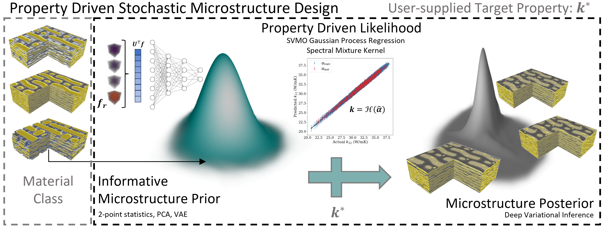
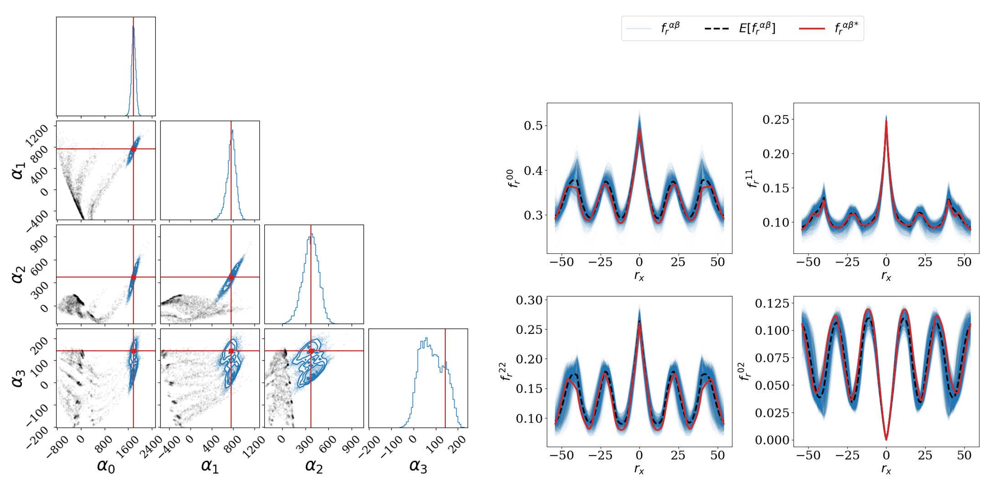

# Inverse Stochastic Microstructure Design

[Preprint](https://papers.ssrn.com/sol3/papers.cfm?abstract_id=4590691)

## Description

This repository contains research code associated with 
*"Inverse Stochastic Microstructure Design"*. The proposed framework enables identifying
a conditional density over 2-point spatial correlations given a set of target thermal
conductivities.

If you find this code useful, interesting, and are open to collaboration, please reach out!
Alternatively, if you have any questions regarding the contents of this repository or portions of the work, feel free
to as well at: [agenerale3@gatech.edu](agenerale3@gatech.edu). Please consider citing this work (expand for BibTeX).

<details>
<summary>
A. Generale, A. Robertson, C. Kelly, S. Kalidindi. Inverse Stochastic Microstructure Design, 2023.
</summary>

```bibtex
@article{generale_inverse_2023,
	address = {Rochester, NY},
	type = {{SSRN} {Scholarly} {Paper}},
	title = {Inverse {Stochastic} {Microstructure} {Design}},
	doi = {10.2139/ssrn.4590691},
	author = {Generale, Adam and Robertson, Andreas E. and Kelly, Conlain and Kalidindi, Surya R.},
	year = {2023}
	}
```
</details>

## Examples
The framework is briefly displayed below. A statistical representation of microstructure, namely, 2-point spatial correlations are first subjected to a orthogonal transformation through Principal Component Analysis (PCA), and subsequently through a nonlinear embedding with a Variational Autoencoder (VAE) for the construction of an information dense hierarchical latent space. This latent space enables the probabilistic inversion of the structure-property linkage.



In the PC latent space (left), the framework is capable of identifying statistical microstructure representations giving rise to target property sets under uncertainty of the forward model. The unseen microstructure representation (red) corresponding to the target set of orthotropic thermal conductivities is recovered by the posterior (blue), with high specificity relative to the complete ensemble (black).

The posterior similarly, recovers the unseen microstructure representation (red) in 2-point spatial correlation space (right), shown in 1D, rather than the complete set in 3D for visual clarity.




## Contents
This section provides a brief description of the contents of this repository.

1. *Models*: Contains code for instantiating the Gaussian mixture model (GMM), sparse variational multi-output
 Gaussian process (SV-MOGP), flow-based generative model, and variational auto-encoder (VAE) used in this work.
 
2. *inputs.h5*: Contains PC scores (computed from 2-point spatial correlations) of initial microstructure
 dataset, alongside corresponding location in the latent space of the VAE and property set.
 
3. *mogp_likelihood_state.pth, mogp_model_state.pth*: Model state dictionaries for the SV-MOGP forward model.

4. *vae.pth*: Model state dictionary for the trained VAE.

5. *main.py*: Main executable for training and post-processing results from the flow-based generative model.

## Execute
Inference of the conditional microstructure distributions provided above can be replicated as
```
python main.py --micro 0
```
where the *micro* flag can be swept from 0-2 for the three current test cases.
